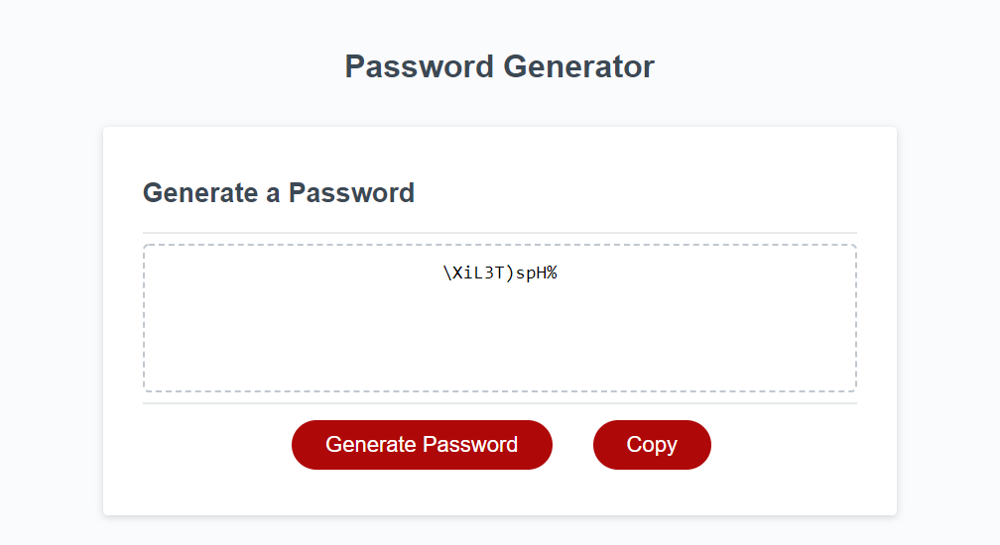

# 03 JavaScript: Password Generator

## Secure and random passwords at the push of a button

- Pressing the Generate Button starts 5 prompts, the first that asks for the length the user would like for their password
then four more asking whether the user would like lowercase, uppercase letters, numbers, and/or special characters.
The password is then generated based on the array made by the selected arrays stated prior, through a loop, chosing random indexes based on math.random for the array length.
- Pressing the Copy Button automatically copys the password onto the user's clip board

## Resources used 

- 
- 
- 

## Preview of site
Click [here](https://tristristy.github.io/C3-PasswordGenerator/) to try out the site.

